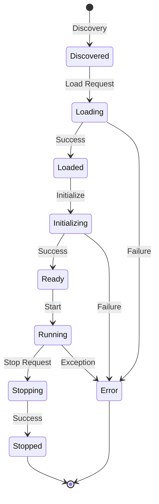

# Plugin Development Guide

This comprehensive guide covers everything you need to know to develop plugins for the MCP Security Platform.

## Table of Contents

1. [Getting Started](#getting-started)
2. [Plugin Architecture](#plugin-architecture)
3. [Development Environment](#development-environment)
4. [Plugin Types](#plugin-types)
5. [Configuration System](#configuration-system)
6. [Event System](#event-system)
7. [Security & Sandboxing](#security--sandboxing)
8. [Testing](#testing)
9. [Deployment](#deployment)
10. [Best Practices](#best-practices)

## Getting Started

### Prerequisites

- Python 3.9 or higher
- Docker (optional, for containerized development)
- Git

### Development Setup

1. **Clone the repository:**
```bash
git clone https://github.com/mcp-security/platform.git
cd platform
```

2. **Install the plugin SDK:**
```bash
cd plugin-sdk
pip install -e .[dev]
```

3. **Set up development environment:**
```bash
# Create plugin directory
mkdir -p plugins/my-plugin/{src,tests,config,docs}

# Initialize plugin manifest
cat > plugins/my-plugin/plugin.json << EOF
{
  "name": "my-plugin",
  "version": "1.0.0",
  "description": "My custom security plugin",
  "plugin_type": "analyzer",
  "entry_point": "src.plugin:MyPlugin"
}
EOF
```

4. **Start the plugin registry:**
```bash
cd services/plugin-registry
python src/registry.py
```

## Plugin Architecture

### Core Components

```
MCP Security Platform
├── Plugin SDK                 # Core interfaces and utilities
│   ├── Base Plugin Interface  # Common plugin functionality
│   ├── Specialized Interfaces # Analyzer, Enricher, Scanner, Notifier
│   ├── Event System          # Pub/sub messaging
│   ├── Configuration Manager  # Dynamic config management
│   └── Runtime Support       # Python and WebAssembly runtimes
├── Plugin Registry           # Plugin discovery and lifecycle management
├── Event Bus                 # Distributed messaging
└── Plugins                   # Your custom plugins
    ├── Analyzer Plugins      # Vulnerability detection
    ├── Enricher Plugins      # Threat intelligence
    ├── Scanner Plugins       # Active scanning
    └── Notifier Plugins      # Alert delivery
```

### Plugin Lifecycle



## Development Environment

### IDE Configuration

#### VS Code Setup

Create `.vscode/settings.json`:
```json
{
    "python.defaultInterpreterPath": "./venv/bin/python",
    "python.linting.enabled": true,
    "python.linting.pylintEnabled": true,
    "python.formatting.provider": "black",
    "python.testing.pytestEnabled": true,
    "python.testing.pytestArgs": ["tests/"]
}
```

#### PyCharm Setup

1. Open the plugin directory as a project
2. Configure Python interpreter to use virtual environment
3. Enable pytest as test runner
4. Configure code style to use Black formatter

### Development Tools

#### Linting and Formatting

```bash
# Format code
black src/ tests/

# Sort imports
isort src/ tests/

# Type checking
mypy src/

# Linting
flake8 src/ tests/
```

#### Testing

```bash
# Run all tests
pytest

# Run with coverage
pytest --cov=src --cov-report=html

# Run specific test
pytest tests/test_analyzer.py::test_analyze_function
```

### Docker Development Environment

Create `docker-compose.dev.yml`:
```yaml
version: '3.8'
services:
  plugin-registry:
    build: ./services/plugin-registry
    ports:
      - "8090:8090"
    volumes:
      - ./plugins:/opt/mcp/plugins
      - ./config:/opt/mcp/config
    environment:
      - REDIS_URL=redis://redis:6379
      - LOG_LEVEL=DEBUG
  
  redis:
    image: redis:7-alpine
    ports:
      - "6379:6379"
  
  my-plugin:
    build: ./plugins/my-plugin
    depends_on:
      - plugin-registry
      - redis
    volumes:
      - ./plugins/my-plugin:/app
```

## Plugin Types

### Analyzer Plugins

Analyzer plugins detect vulnerabilities and security issues:

```python
from mcp_plugin_sdk import AnalyzerPlugin, AnalysisRequest, AnalysisResponse

class StaticCodeAnalyzer(AnalyzerPlugin):
    def __init__(self, context):
        super().__init__(context)
        self.rules = []
        self.stats = {'scanned_files': 0, 'vulnerabilities_found': 0}
    
    async def initialize(self):
        """Load analysis rules and initialize the analyzer."""
        await self._load_rules()
        await self._initialize_ai_models()
        self.logger.info(f"Loaded {len(self.rules)} analysis rules")
    
    async def analyze(self, request: AnalysisRequest) -> AnalysisResponse:
        """Perform static code analysis."""
        start_time = time.time()
        vulnerabilities = []
        
        # Validate request
        if not await self.validate_request(request):
            return self._error_response(request.request_id, "Invalid request")
        
        # Extract target information
        target_type = request.target_type
        target_data = request.target_data
        
        if target_type == "source_code":
            vulnerabilities = await self._analyze_source_code(target_data)
        elif target_type == "binary":
            vulnerabilities = await self._analyze_binary(target_data)
        else:
            return self._error_response(request.request_id, f"Unsupported target type: {target_type}")
        
        # Generate response
        duration = time.time() - start_time
        return AnalysisResponse(
            request_id=request.request_id,
            status="success",
            vulnerabilities=vulnerabilities,
            analysis_duration=duration,
            analyzer_version=self.get_metadata().version
        )
    
    def get_supported_types(self) -> List[str]:
        return ["source_code", "binary", "container_image"]
    
    def get_rules_info(self) -> Dict[str, Any]:
        return {
            "total_rules": len(self.rules),
            "rule_categories": self._get_rule_categories(),
            "supported_languages": ["python", "javascript", "java", "go"]
        }
    
    async def _analyze_source_code(self, target_data):
        """Analyze source code for vulnerabilities."""
        vulnerabilities = []
        
        # Get source code content
        if 'file_path' in target_data:
            content = await self._read_file(target_data['file_path'])
        elif 'content' in target_data:
            content = target_data['content']
        else:
            raise ValueError("No source code provided")
        
        # Apply analysis rules
        for rule in self.rules:
            matches = await rule.analyze(content)
            vulnerabilities.extend(matches)
        
        # AI-powered analysis (if enabled)
        if self.config.get('enable_ai_analysis', False):
            ai_vulns = await self._ai_analyze(content)
            vulnerabilities.extend(ai_vulns)
        
        return vulnerabilities
```

### Enricher Plugins

Enricher plugins add contextual information and threat intelligence:

```python
from mcp_plugin_sdk import EnricherPlugin, EnrichmentRequest, EnrichmentResponse

class ThreatIntelligenceEnricher(EnricherPlugin):
    def __init__(self, context):
        super().__init__(context)
        self.intel_sources = []
        self.cache = {}
    
    async def initialize(self):
        """Initialize threat intelligence sources."""
        await self._setup_intel_sources()
        await self._start_background_updater()
    
    async def enrich(self, request: EnrichmentRequest) -> EnrichmentResponse:
        """Enrich data with threat intelligence."""
        enrichments = []
        
        data_type = request.data_type
        data_value = request.data_value
        
        # Check cache first
        cache_key = f"{data_type}:{data_value}"
        if cache_key in self.cache:
            cached_result = self.cache[cache_key]
            if not self._is_cache_expired(cached_result):
                return cached_result
        
        # Perform enrichment based on data type
        if data_type == "ip":
            enrichments.extend(await self._enrich_ip(data_value))
        elif data_type == "domain":
            enrichments.extend(await self._enrich_domain(data_value))
        elif data_type == "hash":
            enrichments.extend(await self._enrich_hash(data_value))
        elif data_type == "url":
            enrichments.extend(await self._enrich_url(data_value))
        
        # Create response
        response = EnrichmentResponse(
            request_id=request.request_id,
            status="success",
            enrichments=enrichments,
            enrichment_duration=time.time() - start_time
        )
        
        # Cache result
        self.cache[cache_key] = response
        
        return response
    
    async def _enrich_ip(self, ip_address):
        """Enrich IP address with geolocation and reputation data."""
        enrichments = []
        
        # Geolocation enrichment
        geo_data = await self._lookup_geolocation(ip_address)
        if geo_data:
            enrichments.append(EnrichmentResult(
                source_type="ip",
                source_value=ip_address,
                enrichment_type="geolocation",
                enriched_data=geo_data,
                confidence="high",
                source_name="maxmind"
            ))
        
        # Reputation enrichment
        for source in self.intel_sources:
            reputation = await source.lookup_ip_reputation(ip_address)
            if reputation:
                enrichments.append(EnrichmentResult(
                    source_type="ip",
                    source_value=ip_address,
                    enrichment_type="reputation",
                    enriched_data=reputation,
                    confidence=reputation.get('confidence', 'medium'),
                    source_name=source.name
                ))
        
        return enrichments
```

### Scanner Plugins

Scanner plugins perform active security scanning:

```python
from mcp_plugin_sdk import ScannerPlugin, ScanRequest, ScanResponse

class NetworkScanner(ScannerPlugin):
    def __init__(self, context):
        super().__init__(context)
        self.active_scans = {}
        self.scan_results = {}
    
    async def start_scan(self, request: ScanRequest) -> ScanResponse:
        """Start a network security scan."""
        scan_id = str(uuid.uuid4())
        
        # Validate scan request
        if not await self.validate_request(request):
            return ScanResponse(
                request_id=request.request_id,
                scan_id=scan_id,
                status="failed",
                error_message="Invalid scan request"
            )
        
        # Create scan task
        scan_task = asyncio.create_task(
            self._perform_network_scan(scan_id, request)
        )
        
        self.active_scans[scan_id] = {
            'task': scan_task,
            'request': request,
            'start_time': datetime.now(),
            'progress': 0.0
        }
        
        return ScanResponse(
            request_id=request.request_id,
            scan_id=scan_id,
            status="running",
            progress=0.0,
            current_activity="Initializing scan"
        )
    
    async def get_scan_status(self, scan_id: str) -> ScanResponse:
        """Get the status of a running scan."""
        if scan_id not in self.active_scans:
            if scan_id in self.scan_results:
                # Return completed scan
                result = self.scan_results[scan_id]
                return ScanResponse(
                    scan_id=scan_id,
                    status="completed",
                    progress=100.0,
                    result=result
                )
            else:
                raise PluginError(f"Scan {scan_id} not found")
        
        scan_info = self.active_scans[scan_id]
        return ScanResponse(
            scan_id=scan_id,
            status="running",
            progress=scan_info['progress'],
            current_activity=scan_info.get('current_activity', 'Scanning')
        )
    
    async def _perform_network_scan(self, scan_id: str, request: ScanRequest):
        """Perform the actual network scan."""
        try:
            scan_info = self.active_scans[scan_id]
            target = request.target
            scan_type = request.scan_type
            
            findings = []
            
            if scan_type == "port_scan":
                findings.extend(await self._port_scan(target, scan_info))
            elif scan_type == "vulnerability_scan":
                findings.extend(await self._vulnerability_scan(target, scan_info))
            elif scan_type == "service_detection":
                findings.extend(await self._service_detection(target, scan_info))
            
            # Create scan result
            result = ScanResult(
                scan_id=scan_id,
                target=target,
                scan_type=scan_type,
                status="completed",
                start_time=scan_info['start_time'],
                end_time=datetime.now(),
                findings=findings,
                scanner_name=self.plugin_id,
                scanner_version=self.get_metadata().version
            )
            
            # Store result and cleanup
            self.scan_results[scan_id] = result
            del self.active_scans[scan_id]
            
        except Exception as e:
            self.logger.error(f"Scan {scan_id} failed: {e}")
            # Handle scan failure
            self.active_scans[scan_id]['status'] = 'failed'
            self.active_scans[scan_id]['error'] = str(e)
```

### Notifier Plugins

Notifier plugins deliver security alerts and notifications:

```python
from mcp_plugin_sdk import NotifierPlugin, NotificationRequest, NotificationResponse

class MultiChannelNotifier(NotifierPlugin):
    def __init__(self, context):
        super().__init__(context)
        self.channel_handlers = {}
    
    async def initialize(self):
        """Initialize notification channels."""
        await self._setup_email_handler()
        await self._setup_slack_handler()
        await self._setup_webhook_handler()
        await self._setup_sms_handler()
    
    async def send_notification(self, request: NotificationRequest) -> NotificationResponse:
        """Send notifications via multiple channels."""
        results = []
        
        for channel in request.channels:
            try:
                handler = self.channel_handlers.get(channel)
                if not handler:
                    results.append(NotificationResult(
                        notification_id=str(uuid.uuid4()),
                        channel=channel,
                        success=False,
                        status_message=f"Unsupported channel: {channel}"
                    ))
                    continue
                
                # Send notification
                result = await handler.send(request)
                results.append(result)
                
            except Exception as e:
                self.logger.error(f"Failed to send notification via {channel}: {e}")
                results.append(NotificationResult(
                    notification_id=str(uuid.uuid4()),
                    channel=channel,
                    success=False,
                    status_message=str(e)
                ))
        
        # Determine overall status
        successful = sum(1 for r in results if r.success)
        if successful == len(results):
            status = "success"
        elif successful > 0:
            status = "partial"
        else:
            status = "failed"
        
        return NotificationResponse(
            request_id=request.request_id,
            notification_id=str(uuid.uuid4()),
            status=status,
            results=results,
            total_channels=len(request.channels),
            successful_channels=successful,
            failed_channels=len(results) - successful
        )
```

## Configuration System

### Configuration Schema

Define your plugin's configuration schema in `plugin.json`:

```json
{
  "config_schema": {
    "type": "object",
    "properties": {
      "api_key": {
        "type": "string",
        "description": "API key for external service",
        "minLength": 32
      },
      "scan_profiles": {
        "type": "object",
        "properties": {
          "quick": {
            "type": "object",
            "properties": {
              "timeout": {"type": "integer", "default": 30},
              "max_depth": {"type": "integer", "default": 2}
            }
          },
          "deep": {
            "type": "object",
            "properties": {
              "timeout": {"type": "integer", "default": 300},
              "max_depth": {"type": "integer", "default": 10}
            }
          }
        }
      },
      "notification_settings": {
        "type": "object",
        "properties": {
          "enabled": {"type": "boolean", "default": true},
          "channels": {
            "type": "array",
            "items": {
              "type": "string",
              "enum": ["email", "slack", "webhook"]
            }
          },
          "severity_threshold": {
            "type": "string",
            "enum": ["low", "medium", "high", "critical"],
            "default": "medium"
          }
        }
      }
    },
    "required": ["api_key"],
    "additionalProperties": false
  }
}
```

### Dynamic Configuration

Handle configuration updates in your plugin:

```python
class ConfigurablePlugin(BasePlugin):
    async def initialize(self):
        # Load initial configuration
        await self._apply_config(self.config)
    
    async def _on_config_changed(self, new_config: Dict[str, Any]):
        """Handle configuration updates."""
        self.logger.info("Configuration updated")
        
        # Validate new configuration
        await self._validate_config(new_config)
        
        # Apply changes
        await self._apply_config(new_config)
        
        # Restart services if needed
        if self._config_requires_restart(new_config):
            await self._restart_services()
    
    async def _apply_config(self, config: Dict[str, Any]):
        """Apply configuration settings."""
        # Update API credentials
        if 'api_key' in config:
            self.api_client.set_api_key(config['api_key'])
        
        # Update scan profiles
        if 'scan_profiles' in config:
            self.scan_profiles = config['scan_profiles']
        
        # Update notification settings
        if 'notification_settings' in config:
            self.notification_settings = config['notification_settings']
```

### Environment Variables

Support environment variable overrides:

```python
def load_config(self) -> Dict[str, Any]:
    """Load configuration with environment variable support."""
    config = self.config.copy()
    
    # Override with environment variables
    env_mappings = {
        'API_KEY': 'api_key',
        'SCAN_TIMEOUT': 'scan_profiles.quick.timeout',
        'NOTIFICATION_ENABLED': 'notification_settings.enabled'
    }
    
    for env_var, config_path in env_mappings.items():
        env_value = os.getenv(env_var)
        if env_value:
            self._set_nested_config(config, config_path, env_value)
    
    return config
```

## Event System

### Event Types and Structure

The platform uses a comprehensive event system for plugin communication:

```python
# Standard security events
class SecurityEventTypes:
    VULNERABILITY_DETECTED = "security.vulnerability_detected"
    THREAT_DETECTED = "security.threat_detected"
    INCIDENT_CREATED = "security.incident_created"
    SCAN_COMPLETED = "security.scan_completed"

# Custom plugin events
class PluginEventTypes:
    ANALYSIS_REQUESTED = "plugin.analysis_requested"
    ENRICHMENT_COMPLETED = "plugin.enrichment_completed"
    NOTIFICATION_SENT = "plugin.notification_sent"
```

### Event Publishing

```python
async def publish_vulnerability_event(self, vulnerability: VulnerabilityResult):
    """Publish a vulnerability detection event."""
    event = SecurityEvent(
        event_type=SecurityEventTypes.VULNERABILITY_DETECTED,
        source=self.plugin_id,
        data={
            'vulnerability_id': vulnerability.vulnerability_id,
            'title': vulnerability.title,
            'severity': vulnerability.severity,
            'type': vulnerability.vulnerability_type,
            'component': vulnerability.affected_component,
            'location': vulnerability.location,
            'cwe_ids': vulnerability.cwe_ids,
            'mitre_tactics': vulnerability.mitre_tactics
        },
        priority=vulnerability.severity,
        tags=['static-analysis', 'vulnerability'],
        correlation_id=self.current_analysis_id
    )
    
    await self.event_bus.publish(event)
```

### Event Subscription

```python
async def setup_event_subscriptions(self):
    """Set up event subscriptions for the plugin."""
    
    # Subscribe to vulnerability events for enrichment
    await self.event_bus.subscribe(
        subscriber_id=f"{self.plugin_id}-vulnerabilities",
        callback=self.handle_vulnerability_event,
        filters=EventFilter(
            event_types=[SecurityEventTypes.VULNERABILITY_DETECTED],
            min_priority=EventPriority.MEDIUM,
            required_tags=['enrichment-needed']
        )
    )
    
    # Subscribe to scan completion events
    await self.event_bus.subscribe(
        subscriber_id=f"{self.plugin_id}-scans",
        callback=self.handle_scan_completion,
        filters=EventFilter(
            event_types=[SecurityEventTypes.SCAN_COMPLETED],
            sources=['network-scanner', 'web-scanner']
        )
    )

async def handle_vulnerability_event(self, event: SecurityEvent):
    """Handle incoming vulnerability events."""
    try:
        vulnerability_data = event.data
        
        # Enrich vulnerability with threat intelligence
        enrichment_request = EnrichmentRequest(
            request_id=str(uuid.uuid4()),
            data_type="vulnerability",
            data_value=vulnerability_data['vulnerability_id'],
            enrichment_types=['threat_intel', 'cve_info'],
            context={'original_event_id': event.event_id}
        )
        
        enrichment_response = await self.enrich(enrichment_request)
        
        # Publish enriched data
        if enrichment_response.enrichments:
            await self.publish_enrichment_event(
                vulnerability_data['vulnerability_id'],
                enrichment_response.enrichments,
                event.correlation_id
            )
        
    except Exception as e:
        self.logger.error(f"Failed to handle vulnerability event: {e}")
```

### Event Filtering

```python
class AdvancedEventFilter:
    def __init__(self):
        self.severity_weights = {
            'critical': 10,
            'high': 7,
            'medium': 4,
            'low': 1
        }
    
    def create_high_severity_filter(self) -> EventFilter:
        """Create filter for high-severity events only."""
        return EventFilter(
            event_types=[
                SecurityEventTypes.VULNERABILITY_DETECTED,
                SecurityEventTypes.THREAT_DETECTED
            ],
            min_priority=EventPriority.HIGH,
            data_filters=[
                "$.data.severity in ['high', 'critical']",
                "$.data.cvss_score >= 7.0"
            ]
        )
    
    def create_source_filter(self, plugin_ids: List[str]) -> EventFilter:
        """Create filter for specific source plugins."""
        return EventFilter(
            sources=plugin_ids,
            exclude_sources=['test-plugin', 'debug-plugin']
        )
```

## Security & Sandboxing

### Capability-Based Security

Define plugin capabilities and permissions:

```python
# In plugin.json
{
  "capabilities": {
    "required_permissions": [
      "file_system_access",
      "network_access",
      "process_execution"
    ],
    "network_access": true,
    "file_system_access": true,
    "database_access": false,
    "process_execution": true,
    "cpu_intensive": true,
    "memory_intensive": false
  }
}
```

Implement permission checks:

```python
class SecurePlugin(BasePlugin):
    def check_permission(self, permission: str) -> bool:
        """Check if plugin has required permission."""
        required_perms = self.get_metadata().capabilities.required_permissions
        return permission in required_perms
    
    async def read_file(self, file_path: str) -> str:
        """Safely read a file with permission check."""
        if not self.check_permission('file_system_access'):
            raise SecurityError("File system access not permitted")
        
        # Validate file path is within allowed directories
        allowed_paths = [
            self.context.working_directory,
            self.context.temp_directory,
            '/opt/mcp/data'
        ]
        
        abs_path = os.path.abspath(file_path)
        if not any(abs_path.startswith(allowed) for allowed in allowed_paths):
            raise SecurityError(f"Access denied to {file_path}")
        
        async with aiofiles.open(file_path, 'r') as f:
            return await f.read()
```

### WebAssembly Sandboxing

For maximum security, run plugins in WebAssembly sandboxes:

```python
from mcp_plugin_sdk.runtime.wasm import WasmPlugin, WasmResourceLimits

class SecureAnalyzerPlugin(WasmPlugin):
    def __init__(self, context: PluginContext):
        # Define strict resource limits
        limits = WasmResourceLimits(
            max_memory_bytes=16 * 1024 * 1024,  # 16MB
            max_execution_time_ms=5000,         # 5 seconds
            max_fuel=100000,                    # Computation limit
            enable_simd=False,
            enable_bulk_memory=False
        )
        
        wasm_file = Path(context.working_directory) / "analyzer.wasm"
        super().__init__(context, wasm_file, limits)
    
    async def analyze(self, request: AnalysisRequest) -> AnalysisResponse:
        """Perform analysis in WASM sandbox."""
        
        # Convert request to WASM-compatible format
        request_json = json.dumps(request.dict()).encode('utf-8')
        
        # Write request to WASM memory
        await self.sandbox.write_memory(0, request_json)
        
        # Call WASM analysis function
        result_ptr = await self.call_wasm_function(
            "analyze_request",
            [0, len(request_json)],
            timeout_ms=10000
        )
        
        # Read result from WASM memory
        result_size = await self.call_wasm_function("get_result_size", [result_ptr])
        result_json = await self.sandbox.read_memory(result_ptr, result_size)
        
        # Parse response
        result_data = json.loads(result_json.decode('utf-8'))
        return AnalysisResponse(**result_data)
```

### Input Validation

Always validate inputs to prevent injection attacks:

```python
class InputValidator:
    @staticmethod
    def validate_file_path(file_path: str) -> str:
        """Validate and sanitize file path."""
        # Remove null bytes and control characters
        sanitized = ''.join(c for c in file_path if ord(c) >= 32)
        
        # Prevent directory traversal
        if '..' in sanitized or sanitized.startswith('/'):
            raise ValueError("Invalid file path")
        
        # Limit length
        if len(sanitized) > 255:
            raise ValueError("File path too long")
        
        return sanitized
    
    @staticmethod
    def validate_ip_address(ip: str) -> str:
        """Validate IP address format."""
        try:
            ipaddress.ip_address(ip)
            return ip
        except ValueError:
            raise ValueError("Invalid IP address format")
    
    @staticmethod
    def validate_json_input(data: str) -> Dict[str, Any]:
        """Validate and parse JSON input."""
        try:
            parsed = json.loads(data)
            
            # Limit nested depth
            if isinstance(parsed, dict):
                max_depth = 10
                if json_depth(parsed) > max_depth:
                    raise ValueError("JSON too deeply nested")
            
            return parsed
        except json.JSONDecodeError as e:
            raise ValueError(f"Invalid JSON: {e}")

def json_depth(obj, depth=0):
    """Calculate JSON object depth."""
    if isinstance(obj, dict):
        return max(json_depth(v, depth + 1) for v in obj.values()) if obj else depth
    elif isinstance(obj, list):
        return max(json_depth(item, depth + 1) for item in obj) if obj else depth
    return depth
```

## Testing

### Unit Testing

Create comprehensive unit tests for your plugins:

```python
# tests/test_analyzer.py
import pytest
import asyncio
from unittest.mock import Mock, AsyncMock
from pathlib import Path

from mcp_plugin_sdk import PluginContext, AnalysisRequest
from src.analyzer import MyAnalyzerPlugin

@pytest.fixture
async def plugin_context():
    """Create a test plugin context."""
    return PluginContext(
        plugin_id="test-analyzer",
        instance_id="test-instance",
        config={
            "patterns": ["test_pattern"],
            "severity_threshold": "medium"
        },
        logger=Mock(),
        event_bus=AsyncMock(),
        config_manager=AsyncMock(),
        startup_time=datetime.now(),
        working_directory="/tmp/test",
        temp_directory="/tmp/test/temp",
        platform_version="1.0.0",
        api_version="1.0.0"
    )

@pytest.fixture
async def analyzer_plugin(plugin_context):
    """Create analyzer plugin instance."""
    plugin = MyAnalyzerPlugin(plugin_context)
    await plugin.initialize()
    return plugin

@pytest.mark.asyncio
async def test_analyzer_initialization(analyzer_plugin):
    """Test plugin initialization."""
    assert analyzer_plugin.status == PluginStatus.READY
    assert len(analyzer_plugin.rules) > 0

@pytest.mark.asyncio
async def test_source_code_analysis(analyzer_plugin):
    """Test source code analysis."""
    request = AnalysisRequest(
        request_id="test-123",
        target_type="source_code",
        target_data={
            "content": "eval('malicious code')",
            "filename": "test.py"
        }
    )
    
    response = await analyzer_plugin.analyze(request)
    
    assert response.status == "success"
    assert len(response.vulnerabilities) > 0
    assert response.vulnerabilities[0].vulnerability_type == "code_injection"

@pytest.mark.asyncio
async def test_invalid_request(analyzer_plugin):
    """Test handling of invalid requests."""
    request = AnalysisRequest(
        request_id="test-456",
        target_type="unsupported_type",
        target_data={}
    )
    
    response = await analyzer_plugin.analyze(request)
    
    assert response.status == "error"
    assert "unsupported" in response.error_message.lower()

@pytest.mark.asyncio
async def test_configuration_update(analyzer_plugin):
    """Test dynamic configuration updates."""
    new_config = {
        "patterns": ["new_pattern"],
        "severity_threshold": "high"
    }
    
    await analyzer_plugin.reload_config(new_config)
    
    assert analyzer_plugin.config["severity_threshold"] == "high"
    # Verify rules were reloaded
    assert any("new_pattern" in rule.pattern.pattern for rule in analyzer_plugin.rules)

@pytest.mark.asyncio
async def test_event_handling(analyzer_plugin):
    """Test event handling."""
    event = SecurityEvent(
        event_type="analysis.requested",
        source="test-source",
        data={
            "request_id": "event-test",
            "target_type": "source_code",
            "target_data": {"content": "test code"}
        }
    )
    
    await analyzer_plugin._handle_analysis_event(event)
    
    # Verify event was published
    analyzer_plugin.event_bus.publish.assert_called_once()
```

### Integration Testing

Test plugin integration with the registry:

```python
# tests/test_integration.py
import pytest
from services.plugin_registry.src.registry import PluginRegistry, PluginRegistryConfig

@pytest.mark.asyncio
async def test_plugin_registration():
    """Test plugin registration and loading."""
    config = PluginRegistryConfig(
        plugin_directories=["./tests/fixtures/plugins"],
        auto_discovery=True,
        auto_load=False
    )
    
    registry = PluginRegistry(config)
    await registry.start()
    
    try:
        # Discover plugins
        discovered = await registry.discover_plugins()
        assert "test-analyzer:1.0.0" in discovered
        
        # Load plugin
        success = await registry.load_plugin("test-analyzer:1.0.0")
        assert success
        
        # Test plugin functionality
        plugin = registry.get_plugin("test-analyzer:1.0.0")
        assert plugin is not None
        
        # Test health check
        health = await plugin.health_check()
        assert health["status"] == "healthy"
        
    finally:
        await registry.stop()

@pytest.mark.asyncio
async def test_plugin_lifecycle():
    """Test complete plugin lifecycle."""
    registry = PluginRegistry(config)
    await registry.start()
    
    try:
        plugin_id = "test-analyzer:1.0.0"
        
        # Load plugin
        await registry.load_plugin(plugin_id)
        assert plugin_id in registry._plugins
        
        # Reload plugin
        await registry.reload_plugin(plugin_id)
        assert plugin_id in registry._plugins
        
        # Unload plugin
        await registry.unload_plugin(plugin_id)
        assert plugin_id not in registry._plugins
        
    finally:
        await registry.stop()
```

### Performance Testing

Test plugin performance and resource usage:

```python
# tests/test_performance.py
import pytest
import time
import psutil
import asyncio

@pytest.mark.asyncio
async def test_analysis_performance(analyzer_plugin):
    """Test analysis performance with large inputs."""
    # Generate large test file
    large_content = "eval('test')\n" * 10000
    
    request = AnalysisRequest(
        request_id="perf-test",
        target_type="source_code",
        target_data={"content": large_content}
    )
    
    start_time = time.time()
    start_memory = psutil.Process().memory_info().rss
    
    response = await analyzer_plugin.analyze(request)
    
    end_time = time.time()
    end_memory = psutil.Process().memory_info().rss
    
    # Performance assertions
    assert response.status == "success"
    assert end_time - start_time < 10.0  # Should complete within 10 seconds
    assert (end_memory - start_memory) < 100 * 1024 * 1024  # Should use less than 100MB additional memory

@pytest.mark.asyncio
async def test_concurrent_analysis(analyzer_plugin):
    """Test concurrent analysis requests."""
    requests = [
        AnalysisRequest(
            request_id=f"concurrent-{i}",
            target_type="source_code",
            target_data={"content": f"eval('test {i}')"}
        )
        for i in range(10)
    ]
    
    start_time = time.time()
    
    # Run analyses concurrently
    responses = await asyncio.gather(*[
        analyzer_plugin.analyze(req) for req in requests
    ])
    
    end_time = time.time()
    
    # Verify all succeeded
    assert all(r.status == "success" for r in responses)
    assert all(len(r.vulnerabilities) > 0 for r in responses)
    
    # Should be faster than sequential execution
    assert end_time - start_time < 5.0
```

## Deployment

### Containerized Deployment

Create a Dockerfile for your plugin:

```dockerfile
# Dockerfile
FROM python:3.11-slim

# Install system dependencies
RUN apt-get update && apt-get install -y \
    build-essential \
    && rm -rf /var/lib/apt/lists/*

# Set working directory
WORKDIR /app

# Copy requirements first for better caching
COPY requirements.txt .
RUN pip install --no-cache-dir -r requirements.txt

# Copy plugin source
COPY . .

# Install plugin
RUN pip install -e .

# Create non-root user
RUN useradd -m -u 1000 plugin && chown -R plugin:plugin /app
USER plugin

# Health check
HEALTHCHECK --interval=30s --timeout=5s --start-period=10s --retries=3 \
    CMD python -c "import requests; requests.get('http://localhost:8080/health')"

# Run plugin
CMD ["python", "-m", "src.analyzer"]
```

Create a docker-compose configuration:

```yaml
# docker-compose.yml
version: '3.8'

services:
  my-analyzer:
    build: .
    environment:
      - PLUGIN_ID=my-analyzer
      - REGISTRY_URL=http://plugin-registry:8090
      - REDIS_URL=redis://redis:6379
      - LOG_LEVEL=INFO
    volumes:
      - ./config:/app/config
      - ./data:/app/data
    networks:
      - mcp-network
    restart: unless-stopped
    
  plugin-registry:
    image: mcp-security/plugin-registry:latest
    ports:
      - "8090:8090"
    environment:
      - REDIS_URL=redis://redis:6379
    volumes:
      - plugins-data:/opt/mcp/plugins
      - registry-config:/opt/mcp/config
    networks:
      - mcp-network
    depends_on:
      - redis
    
  redis:
    image: redis:7-alpine
    networks:
      - mcp-network
    volumes:
      - redis-data:/data

networks:
  mcp-network:
    driver: bridge

volumes:
  plugins-data:
  registry-config:
  redis-data:
```

### Kubernetes Deployment

Create Kubernetes manifests:

```yaml
# k8s/deployment.yaml
apiVersion: apps/v1
kind: Deployment
metadata:
  name: my-analyzer-plugin
  labels:
    app: my-analyzer-plugin
    component: security-plugin
spec:
  replicas: 2
  selector:
    matchLabels:
      app: my-analyzer-plugin
  template:
    metadata:
      labels:
        app: my-analyzer-plugin
    spec:
      containers:
      - name: analyzer
        image: my-company/my-analyzer:1.0.0
        ports:
        - containerPort: 8080
        env:
        - name: PLUGIN_ID
          value: "my-analyzer"
        - name: REGISTRY_URL
          value: "http://plugin-registry:8090"
        - name: REDIS_URL
          valueFrom:
            secretKeyRef:
              name: redis-config
              key: url
        resources:
          requests:
            memory: "256Mi"
            cpu: "250m"
          limits:
            memory: "512Mi"
            cpu: "500m"
        livenessProbe:
          httpGet:
            path: /health
            port: 8080
          initialDelaySeconds: 30
          periodSeconds: 10
        readinessProbe:
          httpGet:
            path: /ready
            port: 8080
          initialDelaySeconds: 5
          periodSeconds: 5
        volumeMounts:
        - name: config
          mountPath: /app/config
        - name: data
          mountPath: /app/data
      volumes:
      - name: config
        configMap:
          name: my-analyzer-config
      - name: data
        persistentVolumeClaim:
          claimName: my-analyzer-data
      securityContext:
        runAsNonRoot: true
        runAsUser: 1000
        fsGroup: 1000
---
apiVersion: v1
kind: Service
metadata:
  name: my-analyzer-plugin
spec:
  selector:
    app: my-analyzer-plugin
  ports:
  - port: 8080
    targetPort: 8080
  type: ClusterIP
```

### Helm Chart Deployment

Use the platform's Helm charts for deployment:

```yaml
# values.yaml
services:
  my-analyzer:
    enabled: true
    replicaCount: 2
    image:
      repository: "my-company/my-analyzer"
      tag: "1.0.0"
    service:
      port: 8080
      targetPort: 8080
    resources:
      requests:
        memory: "256Mi"
        cpu: "250m"
      limits:
        memory: "512Mi"
        cpu: "500m"
    config:
      patterns:
        - "eval\\("
        - "exec\\("
      severity_threshold: "medium"
    autoscaling:
      enabled: true
      minReplicas: 2
      maxReplicas: 10
      targetCPUUtilizationPercentage: 70
```

Deploy with Helm:

```bash
# Add MCP Helm repository
helm repo add mcp-security https://charts.mcp-security.com
helm repo update

# Install with custom values
helm install my-analyzer mcp-security/mcp-platform \
  --values values.yaml \
  --namespace mcp-security \
  --create-namespace
```

## Best Practices

### Code Quality

1. **Type Hints**: Use type hints throughout your code
2. **Docstrings**: Document all classes and methods
3. **Error Handling**: Handle errors gracefully
4. **Logging**: Use structured logging
5. **Testing**: Achieve >90% test coverage

```python
from typing import List, Dict, Any, Optional
import structlog

class WellDocumentedPlugin(AnalyzerPlugin):
    """
    A well-documented analyzer plugin that follows best practices.
    
    This plugin demonstrates proper code structure, error handling,
    and documentation practices for MCP Security Platform plugins.
    
    Attributes:
        rules: List of analysis rules loaded from configuration
        stats: Runtime statistics for the plugin
    """
    
    def __init__(self, context: PluginContext) -> None:
        """
        Initialize the plugin with the provided context.
        
        Args:
            context: Plugin runtime context with configuration and services
        """
        super().__init__(context)
        self.rules: List[AnalysisRule] = []
        self.stats: Dict[str, int] = {'analyses': 0, 'vulnerabilities': 0}
        self.logger = structlog.get_logger("well_documented_plugin")
    
    async def analyze(self, request: AnalysisRequest) -> AnalysisResponse:
        """
        Perform security analysis on the provided target.
        
        Args:
            request: Analysis request containing target data and parameters
            
        Returns:
            Analysis response with discovered vulnerabilities
            
        Raises:
            PluginError: If analysis fails due to invalid input or system error
            ValidationError: If request validation fails
        """
        try:
            self.logger.info(
                "Starting analysis",
                request_id=request.request_id,
                target_type=request.target_type
            )
            
            # Validate request
            await self._validate_request(request)
            
            # Perform analysis
            vulnerabilities = await self._perform_analysis(request)
            
            # Update statistics
            self.stats['analyses'] += 1
            self.stats['vulnerabilities'] += len(vulnerabilities)
            
            self.logger.info(
                "Analysis completed",
                request_id=request.request_id,
                vulnerabilities_found=len(vulnerabilities)
            )
            
            return AnalysisResponse(
                request_id=request.request_id,
                status="success",
                vulnerabilities=vulnerabilities
            )
            
        except ValidationError as e:
            self.logger.error("Request validation failed", error=str(e))
            raise
        except Exception as e:
            self.logger.error("Analysis failed", error=str(e))
            raise PluginError(f"Analysis failed: {e}")
```

### Performance Optimization

1. **Async Operations**: Use async/await for I/O
2. **Connection Pooling**: Reuse database and HTTP connections
3. **Caching**: Cache expensive operations
4. **Batching**: Process multiple items together
5. **Resource Limits**: Set appropriate limits

```python
class OptimizedPlugin(AnalyzerPlugin):
    def __init__(self, context: PluginContext):
        super().__init__(context)
        self._cache = TTLCache(maxsize=1000, ttl=3600)
        self._http_session = None
        self._db_pool = None
    
    async def initialize(self):
        # Create connection pools
        self._http_session = aiohttp.ClientSession(
            connector=aiohttp.TCPConnector(limit=100),
            timeout=aiohttp.ClientTimeout(total=30)
        )
        
        self._db_pool = await asyncpg.create_pool(
            dsn=self.config['database_url'],
            min_size=5,
            max_size=20
        )
    
    async def analyze_batch(self, requests: List[AnalysisRequest]) -> List[AnalysisResponse]:
        """Analyze multiple requests in batch for better performance."""
        # Group requests by type for optimized processing
        grouped = self._group_requests_by_type(requests)
        
        responses = []
        for target_type, type_requests in grouped.items():
            type_responses = await self._analyze_by_type(target_type, type_requests)
            responses.extend(type_responses)
        
        return responses
    
    @cached(cache=TTLCache(maxsize=500, ttl=1800))
    async def lookup_threat_intel(self, indicator: str) -> Optional[Dict[str, Any]]:
        """Cached threat intelligence lookup."""
        async with self._http_session.get(f"/api/intel/{indicator}") as resp:
            if resp.status == 200:
                return await resp.json()
        return None
```

### Security Best Practices

1. **Input Validation**: Validate all inputs
2. **Least Privilege**: Request minimal permissions
3. **Secure Defaults**: Use secure default configurations
4. **Secrets Management**: Never hardcode secrets
5. **Audit Logging**: Log security-relevant events

```python
class SecurePlugin(BasePlugin):
    def __init__(self, context: PluginContext):
        super().__init__(context)
        
        # Load secrets from secure storage
        self.api_key = self._load_secret('api_key')
        self.encryption_key = self._load_secret('encryption_key')
    
    def _load_secret(self, secret_name: str) -> str:
        """Load secret from secure storage (environment, vault, etc.)."""
        # Try environment variable first
        env_var = f"{self.plugin_id.upper()}_{secret_name.upper()}"
        secret = os.getenv(env_var)
        
        if not secret:
            # Try external secret management system
            secret = self._load_from_vault(secret_name)
        
        if not secret:
            raise ConfigurationError(f"Secret '{secret_name}' not found")
        
        return secret
    
    async def process_sensitive_data(self, data: bytes) -> bytes:
        """Process sensitive data with encryption."""
        # Encrypt data before processing
        encrypted_data = self._encrypt(data)
        
        # Log security event (without sensitive data)
        self.logger.info(
            "Processing sensitive data",
            data_type="encrypted",
            data_size=len(data),
            plugin_id=self.plugin_id
        )
        
        try:
            # Process encrypted data
            result = await self._process_encrypted(encrypted_data)
            return self._decrypt(result)
        finally:
            # Secure cleanup
            self._secure_wipe(encrypted_data)
```

### Monitoring and Observability

1. **Structured Logging**: Use consistent log formats
2. **Metrics**: Expose performance metrics
3. **Health Checks**: Implement comprehensive health checks
4. **Distributed Tracing**: Support request tracing

```python
class ObservablePlugin(AnalyzerPlugin):
    def __init__(self, context: PluginContext):
        super().__init__(context)
        self.metrics = {
            'requests_total': 0,
            'requests_successful': 0,
            'requests_failed': 0,
            'average_duration': 0.0,
            'vulnerabilities_found': 0
        }
    
    async def analyze(self, request: AnalysisRequest) -> AnalysisResponse:
        start_time = time.time()
        trace_id = str(uuid.uuid4())
        
        self.logger.info(
            "Analysis started",
            trace_id=trace_id,
            request_id=request.request_id,
            target_type=request.target_type
        )
        
        try:
            # Perform analysis with tracing
            with self._trace_span("analyze", trace_id):
                response = await self._perform_analysis(request)
            
            # Update metrics
            duration = time.time() - start_time
            self._update_success_metrics(duration, len(response.vulnerabilities))
            
            self.logger.info(
                "Analysis completed successfully",
                trace_id=trace_id,
                request_id=request.request_id,
                duration=duration,
                vulnerabilities_found=len(response.vulnerabilities)
            )
            
            return response
            
        except Exception as e:
            self._update_failure_metrics()
            
            self.logger.error(
                "Analysis failed",
                trace_id=trace_id,
                request_id=request.request_id,
                error=str(e),
                error_type=type(e).__name__
            )
            
            raise
    
    async def health_check(self) -> Dict[str, Any]:
        """Comprehensive health check."""
        health = {
            'status': 'healthy',
            'timestamp': datetime.now().isoformat(),
            'plugin_id': self.plugin_id,
            'version': self.get_metadata().version,
            'uptime': (datetime.now() - self.context.startup_time).total_seconds(),
            'metrics': self.metrics.copy()
        }
        
        # Check dependencies
        try:
            await self._check_database_connection()
            health['database'] = 'connected'
        except Exception as e:
            health['database'] = f'error: {e}'
            health['status'] = 'degraded'
        
        try:
            await self._check_external_api()
            health['external_api'] = 'available'
        except Exception as e:
            health['external_api'] = f'error: {e}'
            health['status'] = 'degraded'
        
        return health
```

This comprehensive guide provides everything needed to develop high-quality, secure, and maintainable plugins for the MCP Security Platform. Follow these patterns and practices to create plugins that integrate seamlessly with the platform and provide value to security operations teams.